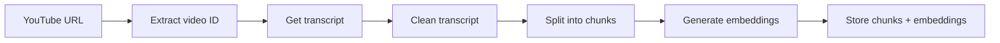
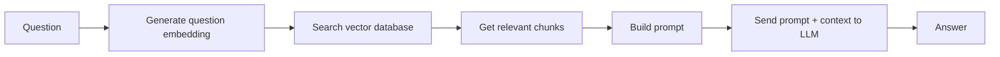
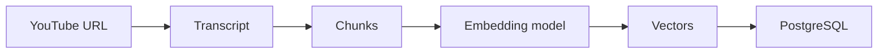
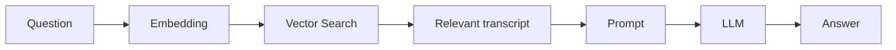

# What we are going to build?
Our final application will be:

                    ┌──────────────────────────┐
                    │       React UI           │
                    │                          │
                    │      YouTube URL         │
                    │ [____________________]   │
                    │ [ Process Video ]        │
                    │ ──────────────────────── │
                    │ Chat                     │
                    │ User: What is RAG?       │
                    │ AI: RAG is...            │
                    │ User: Why embeddings?    │
                    │ AI: Embeddings are...    │
                    └────────────┬─────────────┘
                                 │ HTTP
                                 ▼
                    ┌─────────────────────────┐
                    │    Node + Express       │
                    └────────────┬────────────┘
              ┌──────────────────┼──────────────────┐
              ▼                  ▼                  ▼
       ┌─────────────┐   ┌──────────────┐   ┌─────────────┐
       │  YouTube    │   │ PostgreSQL   │   │   Ollama    │
       │ Transcript  │   │ + pgvector   │   │    LLM      │
       └─────────────┘   └──────────────┘   │ Embeddings  │
                                            └─────────────┘


We'll use:
- Frontend: React + TypeScript + SCSS
- Backend: Node.js + Express + TypeScript
- LLM: Ollama locally
- Embedding model: Ollama locally
- Database: PostgreSQL
- Vector search: pgvector
- YouTube: transcript extraction
- Docker: PostgreSQL/pgvector initially
- No LangChain initially — we will implement the RAG pipeline ourselves.


### Understand the two pipelines first
This is the single most important architectural concept.

### Pipeline A — Ingestion (Video Processing Pipeline)
When the user enters:
> https://www.youtube.com/watch?v=ABC123


This pipeline runs **once per video**.


### Pipeline B — Question answering
When the user asks:
> Why does the speaker use vector databases?


This happens **every time the user asks a question**.


## Prerequisites
1. Node.js  
`node --version`  
`npm --version`

2. Docker  
`docker --version`  
`docker compose version`

3. Ollama  
`npm i ollama`  
`ollama --version`  
`ollama list`

4. Install an LLM  
`ollama pull qwen3:4b`  
`ollama run qwen3:4b`

5. Install an embedding model  
`ollama pull nomic-embed-text` 

Notice the distinction:
```
qwen3:4b → GENERATES ANSWERS
nomic-embed-text → GENERATES VECTORS
```

### Create Docker container using docker-compose.yml
Inside docker-compose.yml file, we configured:
```
environment:
  POSTGRES_DB: vidscribe_rag
  POSTGRES_USER: postgres
  POSTGRES_PASSWORD: postgres
```

This means docker will create a PostgreSQL database called: **vidscribe_rag**


### Create database schema
---
Create the tables, columns, relationships, indexes, and pgvector configuration that our application needs. Eventually we'll have:

```
PostgreSQL Server
│
└── vidscribe_rag      ← Database
    │
    ├── videos
    ├── video_chunks
    ├── conversations
    └── messages
```

Where should you create these tables


### Create tables inside database (hosted on docker)
---
Since we're running PostgreSQL inside Docker, you have several options.
- pgAdmin: we can visually see everything
- psql


### Option A - Using pgAdmin 

- **Step 01:** Connect pgAdmin to your PostgreSQL container. Your connection details are:
```
Host: localhost
Port: 5432
Username: your_username
Password: your_password
Database: your_database_name
```

Once connected, you'll see something like:
```
Servers
└── PostgreSQL
    └── Databases
        └── (your_database_name)
            └── Schemas
                └── public
                    ├── Tables
                    ├── Views
                    └── ...
```

- **Step 02:** 
In pgAdmin Open Query Tool and execute  
`CREATE EXTENSION IF NOT EXISTS vector;`

> **CREATE EXTENSION vector;**  
It doesn't install pgvector. It only enables an extension that must already exist on the PostgreSQL server.

> **Why are we creating the vector extension?**  
Answer: Normally PostgreSQL doesn't understand this: 
[0.12, -0.45, 0.78, ...]
pgvector adds support for storing and searching vectors. Basically this command tells PostgreSQL:
Enable pgvector functionality in this database.

- Step 03: Now create the **videos** table
```
CREATE TABLE videos (
    id SERIAL PRIMARY KEY,
    youtube_video_id VARCHAR(20) NOT NULL UNIQUE,
    url TEXT NOT NULL,
    title TEXT,
    created_at TIMESTAMP DEFAULT CURRENT_TIMESTAMP
);
```

- Step 04: Now create **video_chunks**  
One YouTube video can have many chunks. So, this is a **one-to-many relationship**.

```
CREATE TABLE video_chunks (
    id SERIAL PRIMARY KEY,
    video_id INTEGER NOT NULL
        REFERENCES videos(id)
        ON DELETE CASCADE,
    chunk_index INTEGER NOT NULL,
    content TEXT NOT NULL,
    start_time_seconds REAL,
    end_time_seconds REAL,
    embedding VECTOR(768),
    created_at TIMESTAMP DEFAULT CURRENT_TIMESTAMP
);
```

NOTE:
> **ON DELETE CASCADE** means We don't want its chunks to remain in the database. It means,  
`Delete video → Automatically delete its chunks`

> **start_time_seconds REAL** AND **end_time_seconds REAL**
These store where the chunk occurs in the YouTube video.

> **embedding VECTOR(768)** is where we store the embedding generated by our embedding model. Because the embedding model we're using produces a vector with a specific number of dimensions. (Different embedding models can produce different dimensions)


### Database Migrations
---
In a real project we don't manually open pgAdmin and created the tables, instead we use database migrations. For example: 
```
migrations/
│
├── 001_enable_pgvector.sql
├── 002_create_videos.sql
├── 003_create_video_chunks.sql
├── 004_create_conversations.sql
└── 005_create_messages.sql
```

Then a new developer can clone the project and and get the entire database by running: `npm run db:migrate`


### Option B - Using psql
You can also create everything directly from your Docker container. Run below command

<!-- Enable docker container -->
docker exec -it vidscribe-postgres psql -U postgres -d vidscribe_rag

Now you'll enter PostgreSQL, and run all the same commands that we did in pgAdmin


## we using characters rather than tokens
A production-grade chunker would ideally understand tokens.
But initially: 3000 characters
is much easier to understand than: ~700 tokens

Once the system works, we'll improve it.


# RAG ingestion pipeline


That's the first half of your RAG application.
Later we'll optimize ingestion with batching/concurrency.

# Actual RAG Query




# The LLM isn't directly querying PostgreSQL.
It knows nothing about:
PostgreSQL, pgvector, chunks, embeddings

It simply receives:
instructions + retrieved context + question

This is why the architecture is:
```
Application
   │
   ├── Retrieval
   │
   └── LLM generation
```

<!-- -------------------------------------------- -->

Questions -
- Explain 25. Now implement semantic search
- Explain 26. Implement vector search
- Explain 28. Build chunking
- Why are we using characters rather than tokens?
30. Understand chunking with a real example
<!-- -------------------------------------------- -->

- process-video endpoint
POST /api/videos/process
{
  "url": "https://www.youtube.com/watch?v=YOUR_VIDEO"
}

- chat endpoint
POST /api/videos/1/chat
{
  "message": "What is the main topic of this video?"
}

you should receive -
{
  "answer": "...",
  "sources": [...]
}


in the "ingestion.service.ts", on this below line -
const chunks = createChunks(transcript);

i'm getting this error -

Argument of type 'TranscriptResponse[]' is not assignable to parameter of type 'TranscriptSegment[]'.
Property 'start' is missing in type 'TranscriptResponse' but required in type 'TranscriptSegment'.
chunk.service.ts(5, 3): 'start' is declared here.